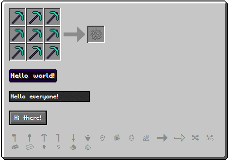

# CSSCraft
#### About
CSSCraft is a public domain project that brings Minecraft-themed elements to your html web page. None of the textures are actually from Minecraft but Minecraft-style recreations. It is written with CSS3 and will most likely not work properly with browsers that do not support CSS3.
Even if attribution is not mandatory some credit would still be nice.

  
You can also have a look at the [Live Preview](https://necr0.github.io/CSSCraft/).

#### Features
* Div Styles
  * Tooltip (.mc-tooltip)
  * Slot (.mc-slot)
  * Gui (.mc-gui)
* Form Elements
  * Textbox (.mc-textbox)
  * Button (.mc-button)
* Wrapping/Alignment
  * 2x2 Slots (.mc-grid-2x2)
  * 3x3 Slots (.mc-grid-3x3)
  * Item (.mc-item)
  * Inline Center Vertical (.center-vertical)
* Block-Rendering from 2D-Images (.mc-block/.mc-block-face-[top/left/right])
* Public Domain Pixel Font (Pixl/.pixl)
* Public Domain Standard Glactic Alphabet Font (Standard Galactic Alphabet/.galactic)
* Public Domain Minecraft-themed Icon Font (Fontcraft/.mc-icon-*)
* Etc.

#### TODO List:
* Animated Icons (Furnace Flame, Progress Arrow)
* Bootstrap 4 Tooltip Integration

#### Resources Used:
* [Fontstruct](http://fontstruct.com)
* [Icomoon](http://icomoon.io)
* [cyChop's pixel2svg fork](https://github.com/cyChop/pixel2svg-fork)
* [GIMP](https://www.gimp.org/)
